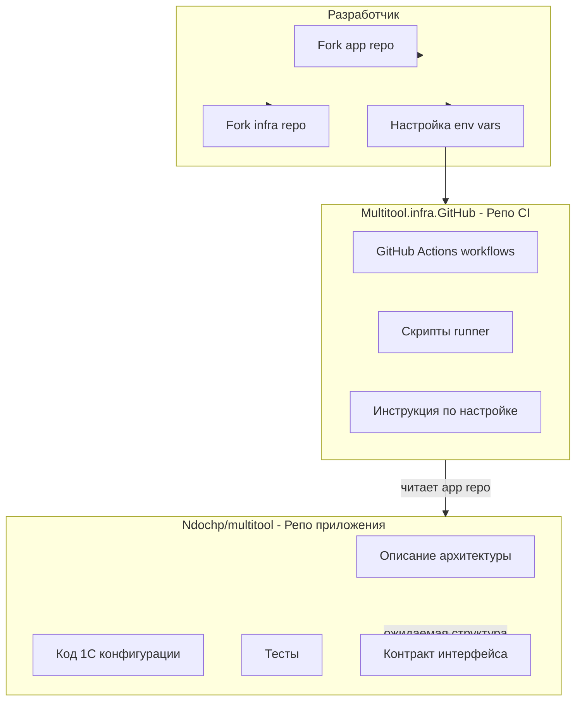

# Архитектура изоляции репозитория приложения и CI-инфраструктуры

## 1. Цели и принципы

- **Репо приложения** содержит только: описание архитектуры, код 1С конфигурации, тесты. Без привязки к конкретному CI (GitHub Actions, GitLab CI, Jenkins и т.д.).
- **Репо CI-инфраструктуры** — отдельный жизненный цикл, переиспользуемость для разных репозиториев 1С.
- **Сценарий**: разработчик форкает оба репо, настраивает переменные окружения и получает тесты на CI/MR и сборку релизных артефактов.

## 2. Разделение ответственности

## 3. Контракт между репозиториями

Репо приложения должно предоставлять:

| Элемент                  | Описание                                                                                                                               |
| ------------------------ | -------------------------------------------------------------------------------------------------------------------------------------- |
| **Структура проекта**    | Стандартная структура EDT (`.project`, `src/`) или структура выгрузки 1С (XML)                                                         |
| **Команды/скрипты**      | Опционально: скрипты `test`, `build` в корне или `scripts/`, вызываемые из CI. Либо документация команд (EDT CLI, Designer batch mode) |
| **Переменные окружения** | Список необходимых: путь к 1C/EDT, учётные данные, путь к тестовой БД                                                                  |

Рекомендуемый документ в репо приложения: `CONTRIBUTING.md` или `docs/CI-contract.md` с описанием этого интерфейса (CI-агностично).

## 4. Архитектура репо Multitool.infra.GitHub

### 4.1 Структура

- `.github/workflows/` — workflows GitHub Actions
- `scripts/` — настройка self-hosted runner (run-local-runner.sh, run-local-runner.ps1)
- `DOC/` — описание архитектуры разделения
- `actions-runner` — в `.gitignore`, создаётся скриптами

### 4.2 Триггеры workflow

| Триггер                | Описание                                                                            |
| ---------------------- | ----------------------------------------------------------------------------------- |
| `workflow_dispatch`    | Ручной запуск с параметром `repository` (owner/repo)                                |
| `repository_dispatch`  | Автозапуск при событиях в репо приложения (требует минимальный workflow в app repo) |
| `schedule`             | Периодическая проверка (cron) для polling-сценария                                  |

Важно: для полной изоляции app repo от GitHub Actions достаточно `workflow_dispatch` и `schedule`. Для автоматического CI на push/PR в app repo нужен либо тонкий триггер в app repo, либо внешний сервис.

### 4.3 Конфигурация через переменные

- `APP_REPOSITORY` — целевой репо (по умолчанию ndochp/multitool)
- `GITHUB_PAT` — Personal Access Token для checkout приватного репо
- `ONE_C_PATH` — путь к 1C:Enterprise или EDT
- `TEST_DATABASE_PATH` — путь к тестовой БД (если используется file-based IB)

### 4.4 Адаптация под 1С

Workflow рассчитан на 1С:

1. **Сборка**: EDT CLI (`edt build`) или Designer batch (`1cv8 DESIGNER /DumpCfg`, `/LoadCfg` и т.п.)
2. **Тесты**: xUnitFor1C (xddTestRunner.epf) или EDT test runner
3. **Артефакты**: выгрузка в XML/DT, публикация Release через `actions/create-release`, `actions/upload-release-asset`

Workflow вызывает скрипты/команды по контракту репо приложения или использует параметризованные шаги.

## 5. Сценарий настройки для разработчика

1. Fork `Ndochp/multitool` (app) и fork `Multitool.infra.GitHub` (infra)
2. В infra repo: Settings → Secrets and variables → Actions: задать `GITHUB_PAT`, `ONE_C_PATH` и т.д.
3. В workflow infra repo задать `APP_REPOSITORY: your-org/your-multitool-fork` (или через переменную/секрет)
4. Установить self-hosted runner для infra repo (через `scripts/run-local-runner.ps1` или `.sh`)
5. Запускать workflow вручную или по расписанию; при необходимости — добавить триггер из app repo

## 6. Описание в репо приложения (Ndochp/multitool)

Рекомендуется документ `docs/CI-integration.md`:

- Ссылка на Multitool.infra.GitHub
- Описание ожидаемой структуры проекта
- Инструкция по форку и настройке для желающих использовать данный CI
- Оговорка, что приложение совместимо с любым CI; приведённая схема — пример для GitHub Actions
